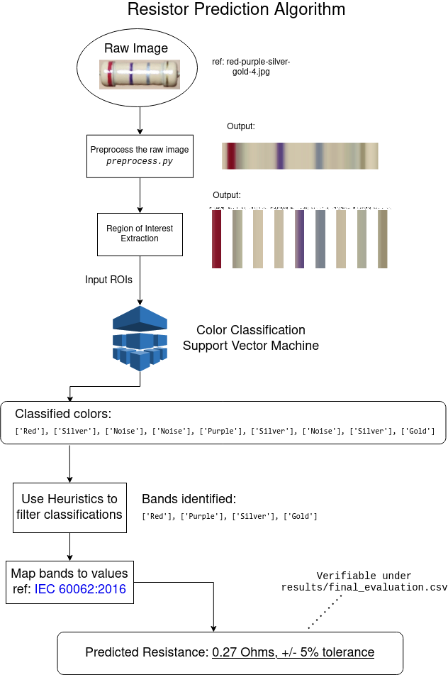

# ResistorPrediction

ResistorPrediction is an overengineered approach to use computer vision [OpenCV] + machine learning project done over Summer break 2023. It predicts the resistance of a 4-band resistor by giving it an image of a resistor as the input.

It's basically a colour classification model wrapped with some logic.

The project might find use in applications in areas such as Robotic Process Automation and Education. 

This project is NOT production ready. It's upper bound accuracy is 60% based on the limited dataset. 

## Navigating the Repo
The important bits (methodology + experiments) are in the jupyter notebooks.
1. Image preprocessing @ `exploration_raw_images.ipynb`
2. Labelled data experiments @ `exploration_labelled_data.ipynb`
3. Color classification ML experiments @ `prediction_experiments.ipynb`
4. Predicting Resistors @ `prodction_resistor_prediction.ipynb`

## Overview

TLDR: How is resistance predicted?

### Results
The results of the final end-to-end test for resistor prediction is under `/results/final_evaluation.csv`.

To summarise, out of 90 datapoints:
- Acceptable results: `54/90` (60%)
- Perfect predictions: `36`
- Partially correct predictions: `18`  
  
Partially correct predictions are predictions where the first three bands of the resistor are correctly identified. This is "good enough" to get the resistance as the last band is the tolerance value.

## Purpose and Rationale 

### Problem Statement
How might we programmatically get the resistance of a resistor simply by taking a picture of it?

### Motivation
Many electrical and computer engineering students do not know the "art" of resistance calculation. Although they may know that the colours mean [something](https://rcccalculator.com/), they do not actively remember which colours map to which value and multiplier value or tolerance.  

A lot of time is wasted manually testing each resistor using a multimeter.   

This was my observation as a student, and as a Teaching Assistant for a Computer Engineering module as well. 

This project was borne to try and create an educational tool to remedy that. My initial aim was to develop an algorithm that could - quickly through the snap of a picture - tell the user not only the resistance, but what colour bands were detected and what values they mapped to.  

### Technical Subproblems
The problem statement create the resistor prediction algorithm, a few subproblems were identified to be solved. These were the most important subproblems to me which I intend to do technical writeups about on my blog... eventually...

1. Image preprocessing & labelling
2. Training and tuning a colour prediction ML model
3. Region of Interest detection
4. Problem reduction

### Known Limitations
- Only 4 band resistors will work
- Pictures with very bright or very dark settings will fail to work in preprocessing
- Unusual resistors with non-beige background colours (such as blue, grey) will likely fail when processed by the Colour Classification SVM

### Area for Improvements
More data and rigorous labelling will be needed to make the Colour classifier more accurate.  

Colour masking might be needed during the preprocessing stage. This approach was initially avoided in order to prevent presupposing certain ranges for colours which is not generalizable to different lighting conditions.